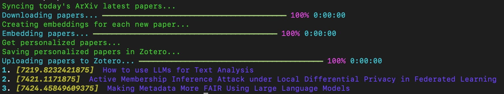
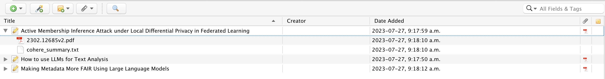

# Read Next
## ReadNext: A Personal Papers Recommender

Every day, approximately 500 new papers are published in the `cs` category on arXiv, with tens more in `cs.AI` alone. Amidst the recent craze around Generative AI, I found it increasingly challenging to keep up with the rapid influx of papers. Distilling the ones that were most relevant to my work and my employer's interests became a daunting task.

ReadNext was born out of these pressing needs:

 - The necessity for a command-line tool, one that could be executed directly or scheduled as a cron job.
 - The requirement to access the latest papers from [arXiv](https://arxiv.org).
 - The integration with [Zotero](https://www.zotero.org), an excellent tool for managing academic papers.
 - The ability to propose a selection of `x` potentially relevant papers based on my current research focus.
  - The proposed papers should be accessible from the command line.
  - The proposed papers should also be easily uploaded to Zotero.

The key focus is to recommend papers that align with my evolving interests and research objectives, which may change on a daily basis and need to be continuously accounted for.

## Install

You can easily install the ReadNext command line tool using `pip`:

```sh
  pip install readnext
```

## Requirements

ReadNext relies on two fundamental external services to enhance its functionality:

 - `Zotero`: Zotero serves as the primary papers management tool, playing a pivotal role in ReadNext's workflow. To configure ReadNext on your local computer, you have to create a Zotero account. If you do not already have one, you will have to create one for yourself, please refer to the section below.
 - `Cohere`: ReadNext leverages Cohere's services for generating paper embeddings and summaries. These embeddings and summaries are essential components for providing personalized and relevant paper recommendations. _It is necessary to create an account with Cohere. We will be expending support for additional embeddings and summarization services in the future, offering increased flexibility._

By integrating these services, ReadNext helps in discovering papers that align with your research interests and focus.

### Zotero Account

If you do not have a Zotero account yet, you can [create one here for free](https://www.zotero.org/user/register). This will give you a basic account with `200MB` of space, sufficient to get started. Afterwards, you can install the desktop application, mobile apps, and necessary browser plugins to fully integrate Zotero into your digital environment.

Take the time to refer to [their extensive online documentation](https://www.zotero.org/support/) to get to know its full potential.

### Cohere Account

For Cohere, you will have to [create an account and login on their Dashboard](https://dashboard.cohere.ai/welcome/register). The services are completely free for the volume and size of request required by ReadNext.

## Configure

ReadNext currently needs to be configured using the environment variables of your terminal session. The following configuration options currently needs to be configured:

|Option|Description|
|------|-----------|
|COHERE_API_KEY| Cohere API Key as [created in their Dashboard here](https://dashboard.cohere.ai/api-keys) |
|ZOTERO_LIBRARY_ID| Your personal library ID as defined in Zotero's backend. This [ID will appears here](https://www.zotero.org/settings/keys) as `Your userID for use in API calls is 750`|
|ZOTERO_LIBRARY_TYPE| Type of library: `user` or `group`|
|ZOTERO_API_KEY| You Zotero API Key, [it needs to be created and managed here](https://www.zotero.org/settings/keys).|
|ZOTERO_INTERESTING_PAPERS_COLLECTION| This is the name/title of the Zotero Collection where you want the ReadNext papers proposals to be saved within Zotero|
|CHROMA_DB_PATH| This is the local path where you want the embedding database management system to save its indexes (ex: `/Users/me/.readnext/chroma_db/`)|
|DOCS_PATH| This is the local path where you want the PDF files of the papers from arXiv to be saved locally (ex: `/Users/me/.readnext/docs/`)|
|RECOMMENDATIONS_PATH| This is the local path where you want the recommended papers to be saved locally (ex: `/Users/me/.readnext/recommendations/`)|

### Setup Environment Variables

#### For Windows

 1. Open the Command Prompt or PowerShell.
 2. Use the `setx` command to create a new environment variable permanently. For example, to set the `ZOTERO_API_KEY`, you can use the following command:

```sh
  setx ZOTERO_API_KEY "your_zotero_api_key_here"
```

The changes will take effect after you open a new command prompt or restart your computer.

#### MacOS and Linux:

 1. Open the Terminal.
 2. Use the `export` command to set the environment variable for the current session. For example, to set the `ZOTERO_API_KEY`, use the following command:

```sh
export ZOTERO_API_KEY="your_zotero_api_key_here"
```

This will set the `ZOTERO_API_KEY` variable for the current session only.

To make the variable permanent, add the `export` command to your shell's configuration file. For example, if you're using Bash, add the line to the `~/.bashrc` or `~/.bash_profile` file. If you're using Zsh, add it to the `~/.zshrc` file. You can do this with a text editor or by using the following command:

```sh
echo 'export ZOTERO_API_KEY="your_zotero_api_key_here"' >> ~/.bashrc
```

Replace `~/.bashrc` with the appropriate file name if you're using a different shell configuration.

After saving the environment variables, they will be available in your command line sessions, and any application that relies on them, such as ReadNext, will be able to access the configured values. Remember to restart your command line or open a new session after making changes to ensure the environment variables take effect.

You can verify that the environment variables are set by running the `env` command in your terminal session.

Here is what the full export looks like:

```sh
export COHERE_API_KEY=""
export ZOTERO_LIBRARY_ID=""
export ZOTERO_API_KEY=""
export ZOTERO_LIBRARY_TYPE="user"
export ZOTERO_INTERESTING_PAPERS_COLLECTION="Propositions"
export CHROMA_DB_PATH="/Users/[MY-USER/.readnext/chroma_db/"
export DOCS_PATH="/Users/[MY-USER]/.readnext/docs/"
export RECOMMENDATIONS_PATH="/Users/[MY-USER]/.readnext/recommendations/"
```

## How it works?

ReadNext is a command line tool that can be used to generate personalized paper recommendations based on your research interests. It is designed to be used as a daily routine to help you discover new papers that are relevant to your research focus.

The tool is designed to be used in conjunction with [Zotero](https://www.zotero.org/), a free and open-source reference management software to manage your research library. ReadNext will use your Zotero library to identify your research interests and focus, and will propose papers that are relevant to your research focus.

ReadNext is designed to be used as a daily routine. It will propose a list of papers that are relevant to your research focus, and will save them in a dedicated collection in your Zotero library. You can then review the proposed papers and decide which ones you want to read. Once you have read a paper, you can move it to another collection in your Zotero library, and ReadNext will learn from your feedback to improve the quality of the proposed papers.

ReadNext is designed to be used with [Cohere](https://cohere.ai/), a free service that provides a powerful API to generate embeddings for text. ReadNext will use Cohere to generate embeddings for the papers in your Zotero library, and will use these embeddings to identify papers that are similar to your research focus.

ReadNext is designed to be used with [arXiv](https://arxiv.org/), a free service that provides access to scientific papers in the fields of mathematics, physics, astronomy, computer science, quantitative biology, statistics, and quantitative finance. ReadNext will use arXiv to identify the latest papers in your research focus, and will propose them to you as part of your daily routine.

The designed userflow is the following:

 1. As a Zotero user, I will create one or multiple "Focus" collections in my Zotero library. Those are the collections where I will add the papers that are the most interesting to my current research. It is expected that the content of those collections will change over time as my research focus and interests evolves.
 2. On a daily basis, I will run `readnext` in my terminal, or I will create a cron job to run it automatically for me.
    1. ReadNext will fetch the latest papers from arXiv
    2. ReadNext will identify the papers that are relevant to your research focus, as defined in Zotero
    3. ReadNext will propose the relevant papers to me and add them to Zotero in a dedicated collection where proposed papers are saved
 3. I will go in Zotero, start to read the proposed papers, and if any are of a particular interest I will add them to one of the "Focus" collections
 4. ReadNext will learn from your feedback to improve the quality of the proposed papers

Now, let's see how to actually do this.

## Usage

### Help

Any time, you can get contextual help for any command like this:

```sh
readnext --help
```

```sh
readnext personalized-papers --help
```

Those commands will tell you which arguments and options are available for each command.

### arXiv categories and subcategories

You can get the full list of arXiv categories and subcategories by running the following command:

```sh
readnext arxiv-top-categories
```

```sh
readnext arxiv-sub-categories
```

Those are the categories where you can get specific new papers from arXiv.

### Getting new papers proposals

To get new papers proposals, you have to run the `personalized-papers` command. That command requires two arguments:

 - `category`: the arXiv top, or sub, category from which you want to get new papers proposals
 - `zotero_collection`: the name of the Zotero collection where your papers of interest are stored in Zotero. This is what we refer to as the "Focus" collection above. The name of the collection is case sensitive and should be exactly as written in Zotero.

Then you also have three options available:

 - `--save-in-zotero` / `-s`: which tells ReadNext that you want to save the proposed papers in Zotero. If you don't use this option, ReadNext will only print the proposed papers in the terminal, but will not save them in Zotero. The default behaviour is that you don't save them in Zotero.
 - `--with-artifacts` / `-a`: which tells ReadNext that you want to save the artifacts (PDF file of the papers and their summarization) into Zotero. This is the recommended workflow, but it requires a lot more space in your Zotero account. If you want to do this, you will most likely need to subscribe to one of their paid option.
 - `--nb-proposals`: which tells ReadNext how many papers you want to be proposed. The default value is 10.

The following command will propose 3 papers from the `cs.AI` caterory, based on the `Focus` collection in my Zotero library, save them in Zotero with all related artifacts:

```sh
readnext personalized-papers cs.AI Focus --save-in-zotero --with-artifacts --nb-proposals=3
```

Here is what it looks like in the terminal:



Here is what it looks like in Zotero:



## Future Work

Here is a list of future work that could be done to improve ReadNext after the initial release:

 - **Adding an Abstraction Layer for Multiple Embedding Services**: Currently, ReadNext utilizes Cohere for embeddings in its initial version. LangChain could serve as a potential abstraction layer to support multiple different embedding services.
 - **Expanding Paper Sources with an Abstraction Layer**: ReadNext aims to integrate additional paper sources beyond just arXiv. This will be facilitated by implementing an abstraction layer for seamless integration.
 - **Enhancing Test Coverage**: To improve testing, we will go beyond testing utility functions and incorporate mocks for external services, ensuring comprehensive test coverage.
 - **Interactive Configuration via Command Line Tool**: We plan to augment the command line tool's functionality, allowing users to configure it directly from the command line using appropriate prompts and interactions.
 - **Refining Paper Selection Process**: Currently, every time readnext is executed, it retrieves today's latest papers from arXiv, identifies relevant papers based on current interests, and matches them against the personal research focus. To further enhance this functionality, we may introduce additional capabilities, such as restricting proposed papers to today's papers only.

## Contributions

We welcome contributions to ReadNext! If you'd like to contribute, please follow these steps:

 1. Fork the repository on GitHub.
 2. Create a new branch with a descriptive name: `git checkout -b feature/your-feature-name`
 3. Make your changes and commit them: `git commit -m "Add feature: your feature name"`
 4. Push your changes to your fork: `git push origin feature/your-feature-name`
 5. Submit a pull request to the `main` branch of the original repository.
